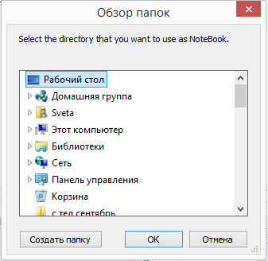
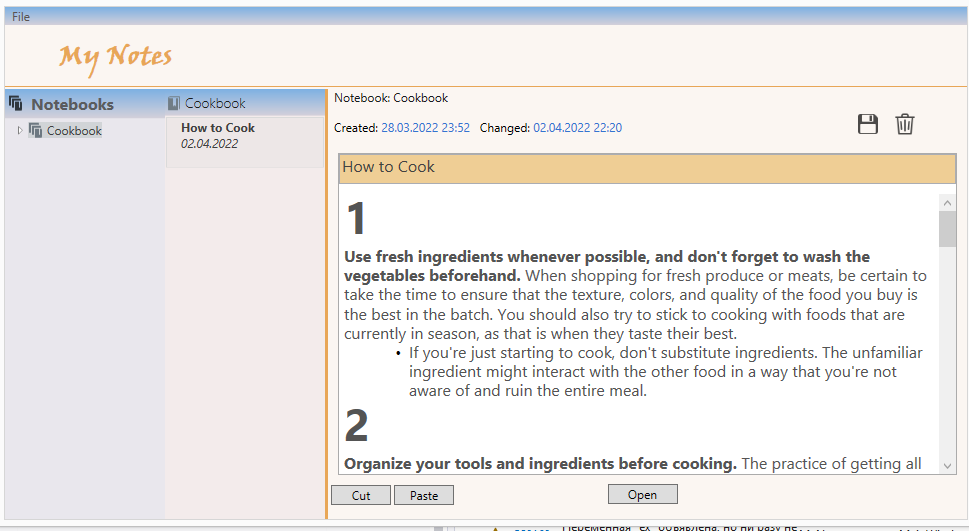
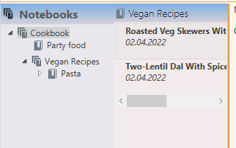
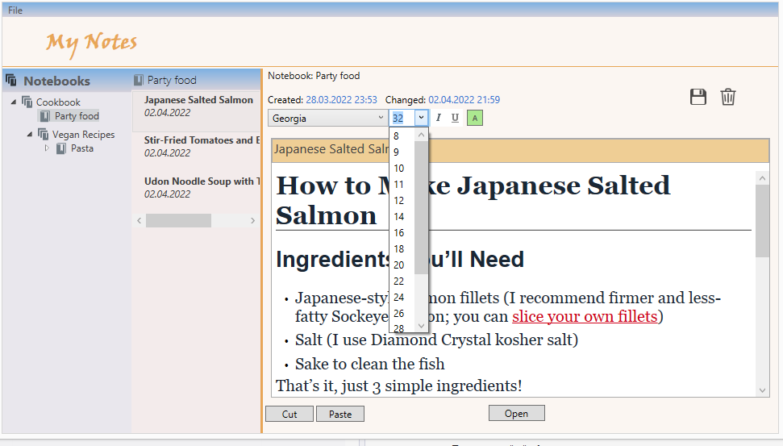
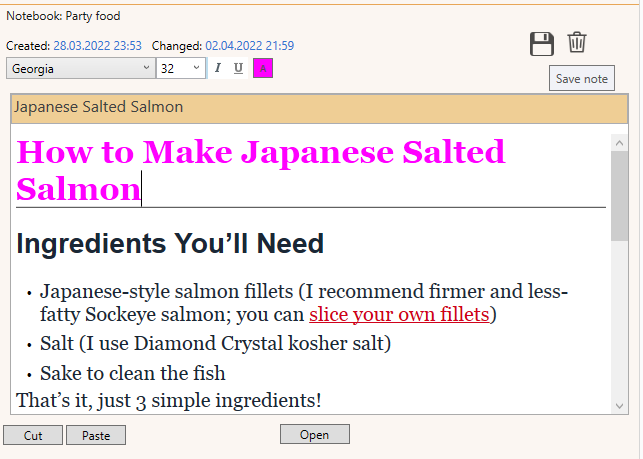
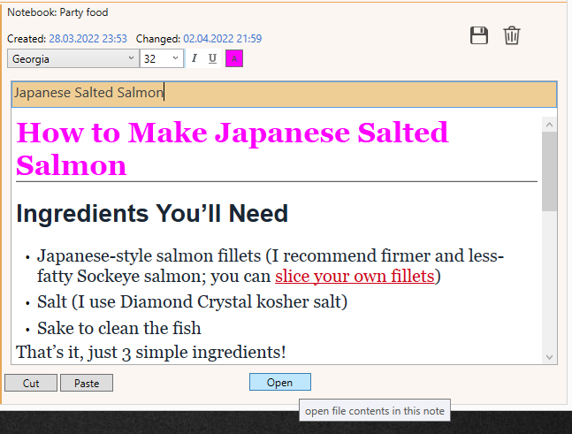
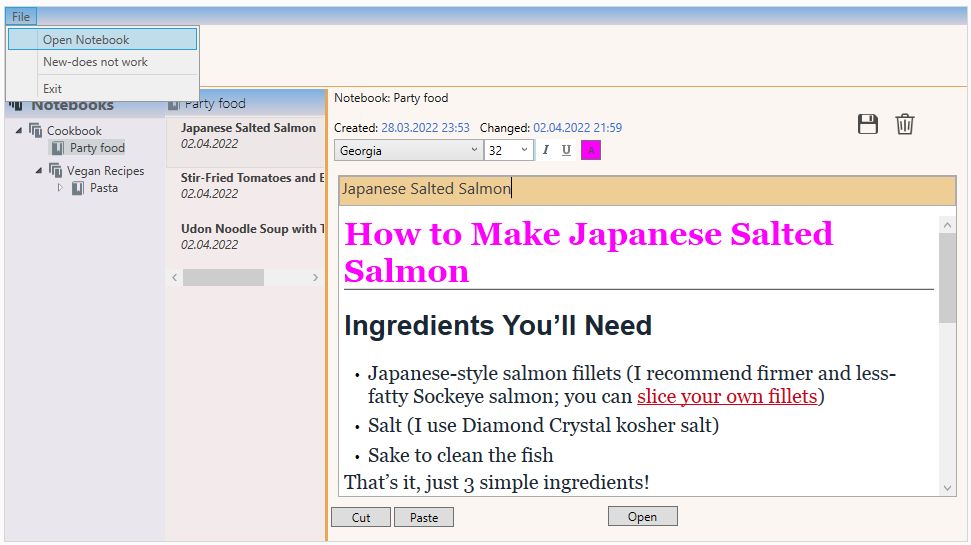

# MyNotes
is an WPF application for viewing, editing, saving, deleting notes in notebooks.

## Installing
You can download the 
[latest release](https://github.com/Sv9ta/MyNotes/releases/download/v1.0.0/MyNotes.exe) and run it.

## Usage
First you need to select the folder in which the notes are stored

you can take 
[these Notebooks](https://github.com/Sv9ta/MyNotes/tree/master/Test%20Notebook) to test.

In the left area is a tree (TreeView) of notebooks. 
Notebooks are directories, notes are files (RTF). 
Notebooks with nested notebooks are indicated
 
Notebooks without nested notebooks are indicated

Уou can edit the note

and you can save the note

You can open another file contents in this note and then save it

Using the top menu, you can open other notebooks or exit

